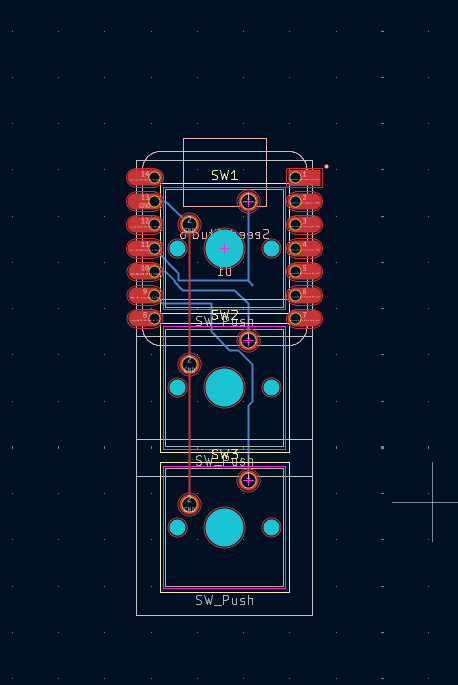

# Hackpad3 — 3-Key Macropad

A custom 3-key macropad built around the Seeed XIAO RP2040, running QMK firmware.




## Overview

Hackpad3 is a compact, direct-wired 3-key macropad. Each switch connects
straight to its own GPIO on the XIAO RP2040 (no row/col matrix scanning
needed), keeping the electronics simple and the firmware lightweight.

## Hardware

- **MCU:** Seeed XIAO RP2040
- **Switches:** Cherry MX x3
- **Diodes:** 1N4148 x3
- **Keycaps:** x3
- **Enclosure:** Custom 3D printed case (see `cad/`)
- **PCB:** Custom 2-layer board (see `pcb/`)
- **Connectivity:** USB-C

## Firmware

Built on [QMK Firmware](https://qmk.fm/). Source lives in [`firmware/`](firmware/).

| Key | Function |
|-----|----------|
| 1 | Mute |
| 2 | Volume Down |
| 3 | Volume Up |

Wiring is direct-pin (no diodes required for scanning, though they're
present on the board): each switch goes straight from a GPIO to ground.

| Key | XIAO pin | RP2040 GPIO |
|-----|----------|-------------|
| 1 | D8 | GP2 |
| 2 | D9 | GP4 |
| 3 | D10 | GP3 |

### Building the firmware

```bash
qmk setup
# copy firmware/keyboards/hackpad3 into <qmk_firmware>/keyboards/hackpad3
qmk compile -kb hackpad3 -km default
```

### Flashing

1. Put the XIAO RP2040 into bootloader mode (hold BOOT, tap RESET, release —
   or double-tap RESET if no BOOT button is exposed).
2. It mounts as a USB drive named `RPI-RP2`.
3. Drag `hackpad3_default.uf2` onto that drive. It flashes and reboots
   automatically.

A pre-built `hackpad3_default.uf2` is included in [`firmware/`](firmware/)
if you'd rather flash without compiling.

## Repo structure

```
├── cad/            # Fusion 360 STEP model of the enclosure
├── pcb/             # KiCad schematic + PCB files
├── firmware/         # QMK keyboard folder + prebuilt .uf2
├── images/          # PCB, schematic, and assembly photos
└── README.md
```

## License

MIT
